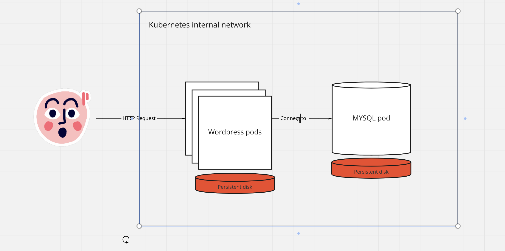
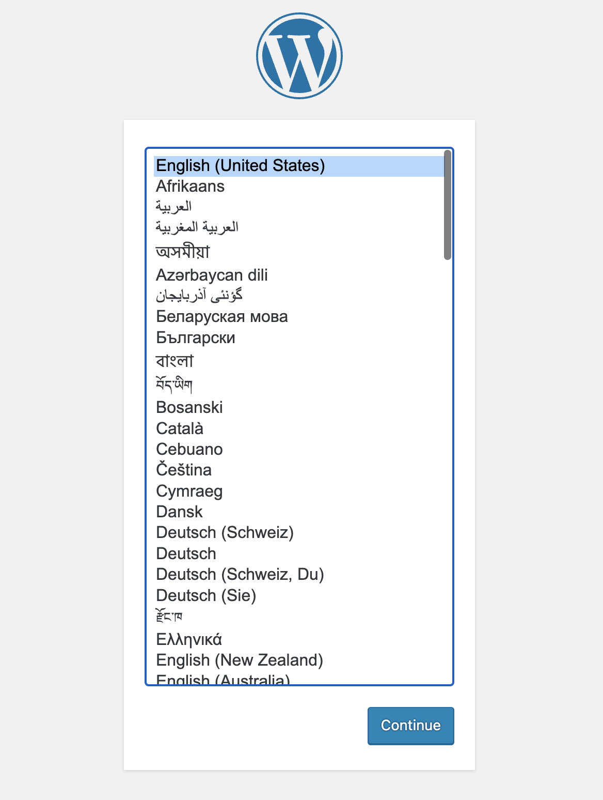

# DIIAGE kubernetes course

## Installing the local cluster

To follow this example you'll need a kubernetes cluster. You'll need to install the [kubectl CLI](https://kubernetes.io/docs/tasks/tools/) for your distribution.

### Using minikube

Follow the [official minikube installation guide](https://minikube.sigs.k8s.io/docs/start/) for your operating system.

You can start a cluster with the following command:
```shell
minikube start --driver=docker
```
> You can use another driver (like `virtualbox` or `hyperkit`) if you prefer. See `minikube start --help` for options.

3. **Check your cluster status**
   ```shell
   minikube status
   ```

4. **Set your kubectl context (if needed)**
   ```shell
   kubectl config use-context minikube
   ```

5. **Access services**
   - To access a service (like WordPress) from your browser, you can use:
     ```shell
     minikube service <service-name>
     ```
   - Or, to get the cluster IP:
     ```shell
     minikube ip
     ```

**Note:**  
If you use `minikube`, you do **not** need to run the `kind` commands below. Just use `minikube` for your cluster management.


### Using Kind
You can create a cluster inside docker using `kind` ([how to install](https://kind.sigs.k8s.io/docs/user/quick-start/))

Once the CLI installed, you can create the cluster by running the following command :

```shell
 kind create cluster --config cluster.yaml
```

We dont need to understand what each line of the `kind-cluster.yml` does for now

## Creating your first pod

Let's create your first pod ! To do that, you can run the following command:

```shell
kubectl run nginx --image=nginx:latest --port=80
```

## About the kubectl CLI

The `kubectl` CLI is one the main tools with which you're going to interact with your kubernetes cluster. All of its
commands have a pretty similar syntax to `docker`.

eg:
```shell
# List running pods
kubectl get pods

# Create a pod nginx
kubectl run nginx --image=nginx:latest

# Debug using an ls command on the nginx pod created previously
kubectl exec -it nginx -- ls /

# Debug by launching another busybox ephemeral container in the pod (best practice)
kubectl debug -it nginx --profile=general --image=busybox

# Get all machines from the kubernetes cluster
kubectl get nodes

# And much more ...
```

## Ok I have my pod running, what now ?


Let's try something more complicated, we're gonna deploy a `wordpress` application inside our `kubernetes` cluster

We want it to look like this: 

### Deployments

_All files must be applied using the following command:_

```bash
kubectl apply -f <yaml_file_path> # (or <directory>)
```

Let's first create our wordpress pods ! The proper way to deploy pods in kubernetes is by using 
an object called `Deployments` since they come with a lot of features that are going to be usefull to us

Let's create our first one in `wordpress/deployment.yaml`

```yaml
apiVersion: apps/v1
kind: Deployment
metadata:
  name: wordpress
  labels:
    app: wordpress
spec:
  selector:
    matchLabels:
      app: wordpress
      tier: frontend
  template:
    metadata:
      labels:
        app: wordpress
        tier: frontend
    spec:
      containers:
        - image: wordpress:latest
          name: wordpress
          env:
            - name: WORDPRESS_DB_HOST
              value: wordpress-mysql
            - name: WORDPRESS_DB_USER
              value: wordpress
            - name: WORDPRESS_DB_PASSWORD
              value: password123
            - name: WORDPRESS_DB_NAME
              value: wordpressdb
          ports:
            - containerPort: 80
              name: wordpress
```

We'll need to create the mysql one as well inside `mysql/deployment.yaml`

```yaml
apiVersion: apps/v1
kind: Deployment
metadata:
  name: wordpress-mysql
  labels:
    app: wordpress
spec:
  selector:
    matchLabels:
      app: wordpress
      tier: mysql
  template:
    metadata:
      labels:
        app: wordpress
        tier: mysql
    spec:
      containers:
        - image: mysql:8.0
          name: mysql
          env:
            - name: MYSQL_DATABASE
              value: wordpressdb
            - name: MYSQL_USER
              value: wordpress
            - name: MYSQL_PASSWORD
              value: password123
            - name: MYSQL_RANDOM_ROOT_PASSWORD
              value: "1"
          args:
            - --character-set-server=utf8mb4
            - --collation-server=utf8mb4_unicode_ci
            - --bind-address=0.0.0.0
          ports:
            - containerPort: 3306
              name: mysql
```


### Services

You can see that both pods are created but only the mysql is staying "up". 
The wordpress is restarting and should probably be in `CrashLoopBackOff` state (meaning it's failing and restarting in a loop).
Why's that ? 

Let's monitor our container by running the following commands:

```sh
kubectl describe pod -l app=wordpress
# No error event

kubectl logs -l app=wordpress 
# Fails with php_network_getaddresses: getaddrinfo failed: Name or service not known in
```


We now know it fails because *The wordpress pod cannot access the db pod* ! 

Because of it's highly distributed nature, kubernetes forces us to use a network abstraction called `Service` to make
containers talk to each other. (Otherwise we'd have to deal with the ever-changing IP address of the pods 
to be able to connect to them !)

Let's create 2 services then

```yaml
# First one to make the DB available
apiVersion: v1
kind: Service
metadata:
  name: wordpress-mysql
  labels:
    app: wordpress
spec:
  ports:
    - port: 3306
  selector:
    app: wordpress
    tier: mysql
  clusterIP: None
```

```yaml
# Another one for wordpress, since we want to access it as well
apiVersion: v1
kind: Service
metadata:
  name: wordpress
  labels:
    app: wordpress
spec:
  ports:
    - port: 80
  selector:
    app: wordpress
    tier: frontend

```

Let's look at the `Endpoint` resource in kubernetes and compare it to the `Pods` 

```sh
kubectl get endpointslice -l app=wordpress
# wordpress-6ztx4         IPv4          80      10.244.2.4   5m12s
# wordpress-mysql-wntjm   IPv4          3306    10.244.1.3   5m21s

kubectl get pods -o wide -l app=wordpress
# wordpress-69bf5655-nnlq6          ...   10.244.2.4 ...
# wordpress-mysql-5b5944747-bntjw   ...   10.244.1.3 ...

kubectl get services -l app=wordpress
# wordpress         ClusterIP   10.96.152.21   <none>        80/TCP     6m58s
# wordpress-mysql   ClusterIP   None           <none>        3306/TCP   7m7s
```

In Kubernetes, a `Service` acts like a stable doorway that lets other parts of your app talk to your `Pods`, even if those `Pods` are constantly changing. Behind the scenes, Kubernetes keeps track of which `Pods` are connected to a `Service` using something called an `EndpointSlice`. You can think of an `EndpointSlice` as a list of the current addresses of all the `Pods` that belong to a `Service`. Whenever `Pods` are added or removed, the `EndpointSlice` is updated automatically, so the `Service` always knows where to send the traffic.


> Note: services are using `selector` to match a pod / list of pods and know where to re-route the traffic to. So you should make sure that the service's `selector` matches some of your pods' `labels`.

At this point your `wordpress` and `mysql` pods should be able to discuss together ! 

To test that it works you can connect to the `wordpress` pods on the port 80 (pod that we're publishing in the deployment)
with the following command: 

```shell
# List pods and find the one called wordpress-<some_id>
kubectl get pods

# Forwards port 80 of the container to your localhost:9090
kubectl port-forward wordpress-<some_id> 9090:80
```

Now by going to your [localhost](http://localhost:9090) you should be able to see the wordpress config page


### Persistent storage

Now, if you've followed the previous steps, you should have a working wordpress configuration ...
almost.

Let's configure wordpress completely. Once done go to your console and do a :

```shell
# Delete the mysql pod
kubectl delete pods wordpress-mysql-<some_id>
# Restart wordpress for good measure (since it has lost connection)
kubectl delete pods wordpress<some_id>
```

If you retry to access the `wordpress` container with the `port-foward` command, you'll notice that the app is now back
at the configuration-level 😭.

This happens because we're missing *persistence*. By default, in containers, we're storing data on the host on which 
the pod is running ... which is problematic when you never know which pod is going to go where ! That's why kubernetes 
has the concept of `PersistentVolumeClaim` which acts as a volume that you mount on your container and that can be used
to store data and that will never disapear even when a pod restarts !

Since we want to save or data in both the DB and wordpress (images, ...) Let's create 2 PVC:

```yaml
# PVC for wordpress pods, notice the storage request ?
apiVersion: v1
kind: PersistentVolumeClaim
metadata:
  name: wp-pv-claim
  labels:
    app: wordpress
spec:
  accessModes:
    - ReadWriteOnce
  resources:
    requests:
      storage: 20G
```

```yaml
# Same thing for mysql
apiVersion: v1
kind: PersistentVolumeClaim
metadata:
  name: mysql-pv-claim
  labels:
    app: wordpress
spec:
  accessModes:
    - ReadWriteOnce
  resources:
    requests:
      storage: 20Gi
```

You should be able to see your 2 PVC created and `Pending`. They are in `Pending` state because they are waiting to be
attached to a given pod / set of pods, so let's attach them !

To do that we need to modify our deployments by adding `volumes` and `volumeMounts` to our config:
```yaml
apiVersion: apps/v1
kind: Deployment
metadata:
  name: wordpress-mysql
  labels:
    app: wordpress
spec:
  selector:
    matchLabels:
      app: wordpress
      tier: mysql
  strategy:
    type: Recreate
  template:
    metadata:
      labels:
        app: wordpress
        tier: mysql
    spec:
      containers:
        - image: mysql:5.6
          name: mysql
          env:
            - name: MYSQL_ROOT_PASSWORD
              value: password123
          ports:
            - containerPort: 3306
              name: mysql
          # NEW
          volumeMounts:
            - name: mysql-persistent-storage # Must match the name of a volume in volumes
              mountPath: /var/lib/mysql
      # NEW
      volumes:
        - name: mysql-persistent-storage
          persistentVolumeClaim:
            # Name of the pvc created in pvc.yaml
            claimName: mysql-pv-claim
```

Same thing should be done for wordpress: 

```yaml
apiVersion: apps/v1
kind: Deployment
metadata:
  name: wordpress
  labels:
    app: wordpress
spec:
  selector:
    matchLabels:
      app: wordpress
      tier: frontend
  strategy:
    type: Recreate
  template:
    metadata:
      labels:
        app: wordpress
        tier: frontend
    spec:
      containers:
        - image: wordpress:4.8-apache
          name: wordpress
          env:
            - name: WORDPRESS_DB_HOST
              value: wordpress-mysql
            - name: WORDPRESS_DB_PASSWORD
              value: password123
          ports:
            - containerPort: 80
              name: wordpress
          volumeMounts:
            - name: wordpress-persistent-storage
              mountPath: /var/www/html # Different path
      volumes:
        - name: wordpress-persistent-storage
          persistentVolumeClaim:
            claimName: wp-pv-claim
```

and re-apply your config by doing: 
```shell
kubectl apply -f mysql/deployment.yaml -f wordpress/deployment.yaml
```

Your volumes should now be in `Bound` state and your pods `Running`

If your try to look on localhost again, you should be able to re-configure your wordpress, kill it like last time but this time, data
should have been persisted and you should be able to see your config even when the pod restarted !


### Secrets

Now that the app works, we start working on improving our application. First step is to improve security !

You've probably noticed that we're passing a string `password123` in clear text for both the `wordpress` and `mysql`. 
This creates 2 issues:
- First, you have a password in clear-text in the code
- Second, your password is not shared by applications, if the mysql operator decides to change the DB password he'll 
have to change it everywhere by hand !

To avoid both issues, kubernetes has a `Secret` object that store a list of keys of your choice and that can either be 
mounted or used as an environment variable. We're going to do the latter and replace our password123 value by a shared secret !

In kubernetes, secrets are by default using a `base64` encoding to make sure the value is not in clear-text (not the most secure way of doing things though)
``

We can create the secret with kubectl and, as we did with our volumes, bind it inside our deployments:

```shell
# Create a secret with a new password
kubectl create secret generic mysql-pass --from-literal=password='MY_PASSWORD_123'
```

```yaml
# mysql/deployment.yqml
apiVersion: apps/v1
kind: Deployment
metadata:
  name: wordpress-mysql
  labels:
    app: wordpress
spec:
  selector:
    matchLabels:
      app: wordpress
      tier: mysql
  strategy:
    type: Recreate
  template:
    metadata:
      labels:
        app: wordpress
        tier: mysql
    spec:
      containers:
        - image: mysql:5.6
          name: mysql
          env:
            - name: MYSQL_ROOT_PASSWORD
              # NEW
              valueFrom:
                secretKeyRef:
                  key: password # matches on of the key inside our secret  
                  name: mysql-pass # matches the metadata.name of our secret
          ports:
            - containerPort: 3306
              name: mysql
          volumeMounts:
            - name: mysql-persistent-storage
              mountPath: /var/lib/mysql
      volumes:
        - name: mysql-persistent-storage
          persistentVolumeClaim:
            claimName: mysql-pv-claim
```

```yaml
apiVersion: apps/v1
kind: Deployment
metadata:
  name: wordpress
  labels:
    app: wordpress
spec:
  selector:
    matchLabels:
      app: wordpress
      tier: frontend
  strategy:
    type: Recreate
  template:
    metadata:
      labels:
        app: wordpress
        tier: frontend
    spec:
      containers:
        - image: wordpress:4.8-apache
          name: wordpress
          env:
            - name: WORDPRESS_DB_HOST
              value: wordpress-mysql
            - name: WORDPRESS_DB_PASSWORD
              valueFrom:
                secretKeyRef:
                  key: password
                  name: mysql-pass
          ports:
            - containerPort: 80
              name: wordpress
          volumeMounts:
            - name: wordpress-persistent-storage
              mountPath: /var/www/html
      volumes:
        - name: wordpress-persistent-storage
          persistentVolumeClaim:
            claimName: wp-pv-claim

```
To make it work we need to delete the existing mysql `Deployment` and `PVC` and reapply them from 0 (since we changed the password). Then the only thing to do is to re-apply the deployments and the app should still work but now more secure ! 

```shell
 kubectl delete pvc mysql-pv-claim
 kubectl delete deploy wordpress-mysql
 kubectl apply -f mysql/pvc.yaml -f mysql/deployment.yaml -f wordpress/deployment.yaml
 kubectl rollout restart deployment wordpress
```

### ConfigMaps

While `Secrets` are great for sensitive data like passwords, `ConfigMaps` are perfect for non-sensitive configuration like database hostnames, ports, or application settings.

Let's move our database configuration to a `ConfigMap`:

```yaml
# configmap.yaml
apiVersion: v1
kind: ConfigMap
metadata:
  name: mysql-config
data:
  mysql.cnf: |
    [mysqld]
    # Character Set
    character-set-server=utf8mb4
    collation-server=utf8mb4_unicode_ci
    init-connect='SET NAMES utf8mb4'
    
    [mysql]
    default-character-set=utf8mb4
    
    [client]
    default-character-set=utf8mb4
```

Now update our deployments to use the `ConfigMap`:

```yaml
# mysql/deployment.yaml or mysql/statefulset.yaml
apiVersion: apps/v1
kind: Deployment  # or StatefulSet
metadata:
  name: wordpress-mysql
  labels:
    app: wordpress
spec:
  selector:
    matchLabels:
      app: wordpress
      tier: mysql
  strategy:
    type: Recreate
  template:
    metadata:
      labels:
        app: wordpress
        tier: mysql
    spec:
      containers:
      - image: mysql:8.0
        name: mysql
        env:
        - name: MYSQL_ROOT_PASSWORD
          valueFrom:
            secretKeyRef:
              name: mysql-pass
              key: password
        - name: MYSQL_DATABASE
          value: wordpress
        ports:
        - containerPort: 3306
          name: mysql
        # ADDED
        volumeMounts:
        - name: mysql-persistent-storage
          mountPath: /var/lib/mysql
        - name: mysql-config
          mountPath: /etc/mysql/conf.d/my.cnf
          subPath: my.cnf
      # ADDED
      volumes:
      - name: mysql-persistent-storage
        persistentVolumeClaim:
          claimName: mysql-pv-claim
      - name: mysql-config
        configMap:
          name: mysql-config
```

Apply the changes:

```shell
kubectl apply -f configmap.yaml
kubectl apply -f mysql-deployment.yaml
kubectl rollout restart deployment wordpress-mysql
```

**Benefits of using ConfigMaps:**

- **Centralized configuration**: Change database host in one place, affects all pods
- **Environment-specific configs**: Different ConfigMaps for dev/staging/prod
- **Version control**: Configuration changes are tracked in your manifests
- **Easy updates**: Modify ConfigMap and restart pods to pick up new values

**Alternative ways to use ConfigMaps:**

```yaml
# Mount as files
volumeMounts:
  - name: config-volume
    mountPath: /etc/config
volumes:
  - name: config-volume
    configMap:
      name: wordpress-config

# Use individual keys as env vars
env:
  - name: WORDPRESS_DB_HOST
    valueFrom:
      configMapKeyRef:
        name: wordpress-config
        key: WORDPRESS_DB_HOST
```

### Using a StatefulSet for MySQL

So far we used a `Deployment` for MySQL. For stateful workloads like databases, Kubernetes provides `StatefulSet` which gives:

- Stable network identity: each pod gets a predictable DNS name like `wordpress-mysql-0`.
- Stable persistent storage: each replica gets its own `PersistentVolume` via `volumeClaimTemplates`.
- Ordered, graceful rolling updates.

For a single-node MySQL suitable for this tutorial, you can switch to a `StatefulSet` with a headless `Service`:

```yaml
# mysql/service.yaml (headless service required by StatefulSet)
apiVersion: v1
kind: Service
metadata:
  name: wordpress-mysql
  labels:
    app: wordpress
spec:
  clusterIP: None
  selector:
    app: wordpress
    tier: mysql
  ports:
    - port: 3306
      name: mysql
```

```yaml
# mysql/statefulset.yaml
apiVersion: apps/v1
kind: StatefulSet
metadata:
  name: wordpress-mysql
  labels:
    app: wordpress
spec:
  serviceName: wordpress-mysql
  replicas: 1
  selector:
    matchLabels:
      app: wordpress
      tier: mysql
  updateStrategy:
    type: RollingUpdate
  template:
    metadata:
      labels:
        app: wordpress
        tier: mysql
    spec:
      securityContext:
        fsGroup: 999
      containers:
        - name: mysql
          image: mysql:5.6
          env:
            - name: MYSQL_ROOT_PASSWORD
              valueFrom:
                secretKeyRef:
                  name: mysql-pass
                  key: password
          ports:
            - containerPort: 3306
              name: mysql
          volumeMounts:
            - name: data
              mountPath: /var/lib/mysql
  volumeClaimTemplates:
    - metadata:
        name: data
        labels:
          app: wordpress
      spec:
        accessModes: ["ReadWriteOnce"]
        resources:
          requests:
            storage: 20Gi
```

Notes:

- The `serviceName` in the `StatefulSet` must match the headless `Service` name.
- Keep `replicas: 1` unless you implement proper MySQL replication (beyond this tutorial’s scope).
- Update the WordPress DB host to the service DNS (`wordpress-mysql`) or the specific pod (`wordpress-mysql-0.wordpress-mysql`) if needed.

Apply it like this:

```shell
kubectl delete deploy wordpress-mysql || true
kubectl apply -f mysql/service.yaml -f mysql/statefulset.yaml
```

### Ingress

Congratz our application is now working ! One last thing though, is that it's not accessible from outside of the kubernetes cluster,
this is why you still have to run `port-forward` commands to access your `wordpress` pods. But your users cannot do that !
Let's give them access to our wordpress pod.

This is done by using an `Ingress` object. Ingresses are pods running in your cluster that are forwarding traffic from the outside thanks to a "special" type of `Service`
(either `NodePort` in kind's case or `LoadBalancer` when in the cloud)

Ingresses controllers (the tool that's handling ingresses creation) are `addons` that need to be added to a cluster by the operators, we have to install one first ! The most common one is 
`NGINX` (but [a lot of solutions](https://kubernetes.io/docs/concepts/services-networking/ingress-controllers/) exists )

```shell
# Install the NGINX ingress controller
kubectl apply -f https://raw.githubusercontent.com/kubernetes/ingress-nginx/main/deploy/static/provider/kind/deploy.yaml
```

Now we can create an ingress that will redirect a call to `http://localhost:8080/` to our wordpress pods

```yaml
apiVersion: networking.k8s.io/v1
kind: Ingress
metadata:
  name: wordpress-ingress
spec:
  rules:
    - http:
        paths:
        - pathType: Prefix
          path: "/"
          backend:
            service:
              name: wordpress
              port:
                number: 80

```

You should now be able to access your application from outside the cluster ! 🎉


### Helm: create a chart and add MySQL as a dependency

Helm lets you templatize and version your manifests. We'll create a tiny chart for WordPress and pull in MySQL from a maintained chart.

Prereqs: install Helm from the official docs.

```shell
brew install helm # macOS
```

Create a chart skeleton:

```shell
helm create wp
```

This creates a `wp/` directory. We will: (1) add Bitnami MySQL as a dependency, and (2) keep a minimal WordPress `Deployment` and `Service` template using values.

Add MySQL dependency:

```yaml
# wp/Chart.yaml
apiVersion: v2
name: wp
description: WordPress with MySQL (Bitnami) demo
type: application
version: 0.1.0
appVersion: "1.0.0"
dependencies:
  - name: mysql
    version: 9.x.x
    repository: https://charts.bitnami.com/bitnami
```

Configure values for both WordPress and MySQL:

```yaml
# wp/values.yaml
namespace: wordpress

wordpress:
  image: wordpress:4.8-apache
  service:
    type: ClusterIP
    port: 80
  resources:
    requests:
      cpu: 100m
      memory: 256Mi
    limits:
      cpu: 500m
      memory: 512Mi
  db:
    host: "{{ .Release.Name }}-mysql" # service name created by the dependency
    passwordSecretName: mysql-pass # optional if you want to reuse an existing secret

mysql:
  auth:
    rootPassword: "MY_PASSWORD_123" # for demo; use secrets in real setups
    database: wordpress
    username: wp_user
    password: wp_password
  primary:
    persistence:
      enabled: true
      size: 20Gi
```

Create minimal WordPress templates using the values above (example skeletons):

```yaml
# wp/templates/wordpress-deployment.yaml
apiVersion: apps/v1
kind: Deployment
metadata:
  name: {{ include "wp.fullname" . }}
  labels:
    app.kubernetes.io/name: {{ include "wp.name" . }}
spec:
  replicas: 1
  selector:
    matchLabels:
      app.kubernetes.io/name: {{ include "wp.name" . }}
  template:
    metadata:
      labels:
        app.kubernetes.io/name: {{ include "wp.name" . }}
    spec:
      containers:
        - name: wordpress
          image: {{ .Values.wordpress.image }}
          ports:
            - containerPort: 80
          env:
            - name: WORDPRESS_DB_HOST
              value: {{ .Values.wordpress.db.host | quote }}
            - name: WORDPRESS_DB_PASSWORD
              value: {{ .Values.mysql.auth.password | default .Values.mysql.auth.rootPassword | quote }}
          resources: {{- toYaml .Values.wordpress.resources | nindent 12 }}
```

```yaml
# wp/templates/wordpress-service.yaml
apiVersion: v1
kind: Service
metadata:
  name: {{ include "wp.fullname" . }}
spec:
  type: {{ .Values.wordpress.service.type }}
  selector:
    app.kubernetes.io/name: {{ include "wp.name" . }}
  ports:
    - port: {{ .Values.wordpress.service.port }}
      targetPort: 80
```

Vendor dependencies and install:

```shell
helm repo add bitnami https://charts.bitnami.com/bitnami
helm dependency update wp
helm install wp ./wp -n wordpress --create-namespace
```

Upgrade with new values (e.g., change WordPress image):

```shell
helm upgrade wp ./wp -n wordpress -f wp/values.yaml
```

Uninstall and cleanup:

```shell
helm uninstall wp -n wordpress
```

Notes:

- The Bitnami MySQL chart creates a Service named `RELEASE-NAME-mysql` by default, hence `WORDPRESS_DB_HOST` uses `{{ .Release.Name }}-mysql`.
- For production, avoid plain-text passwords; consider External Secrets/Sealed Secrets and set `mysql.auth.existingSecret`.
- You can add an Ingress template to the chart, or reuse the earlier `Ingress` manifest with `ingressClassName: nginx`.